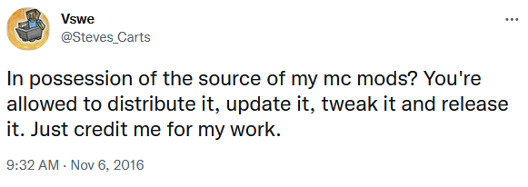

Steve's Factory Manager
=======
Steve's Factory Manager is a Minecraft mod which allows you to set up systems that moves and manages items between inventories and machines.

### Development

Fork and run `gradlew` as normal. See [GTNH Dev](https://gtnh.miraheze.org/wiki/Development).

### License

 https://twitter.com/Steves_Carts/status/795197105849729024
